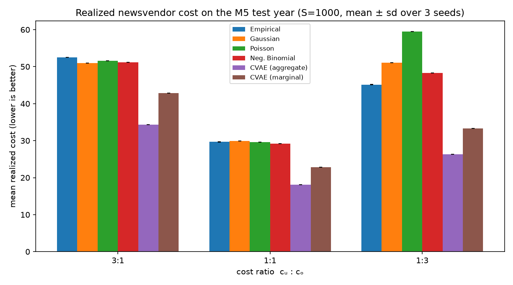

# demand-scenario-vae

A conditional VAE generates retail demand scenarios, a newsvendor model orders against them, and everything is scored on realized decision cost.



The CVAE cuts realized newsvendor cost against all four classical baselines at all three pre-registered cost ratios. At the 1:1 ratio it is 38% below the fitted Negative Binomial, which is the hardest baseline in the set. All twelve paired bootstrap intervals (10,000 resamples, paired on 651,406 test windows) exclude zero.

## What this is

A retailer has to commit to an order quantity before demand is known. The optimal order is a quantile of the demand distribution, not its mean, so a point forecast is the wrong input to the decision. I train a conditional VAE with a Negative Binomial decoder on M5 (Walmart) weekly FOODS data to sample joint 4-week demand scenarios given context (store, item, season, price, recent demand). A sample average approximation newsvendor turns each scenario set into an order, and every model is judged on the cost that order actually incurs against held-out demand. Four classical baselines (empirical resampling, Gaussian, Poisson, fitted Negative Binomial, each fitted per series) sit behind the same sampler interface, so the decision and evaluation layers are identical for all models.

## Architecture


<!-- TODO: add figures/architecture.png -->

## Results

Mean realized cost on the test year (651,406 windows, S=1000 scenarios, mean over 3 seeds, seed std at or below 0.01). Lower is better.

| Model | 3:1 | 1:1 | 1:3 |
|---|---|---|---|
| CVAE (this project) | **34.35** | **18.14** | **26.30** |
| Fitted Negative Binomial | 51.20 | 29.17 | 48.30 |
| Empirical resampling | 52.48 | 29.66 | 45.15 |
| Gaussian | 50.97 | 29.93 | 51.03 |
| Poisson | 51.61 | 29.63 | 59.44 |

Full tables including service level, fill rate, CRPS, coverage, and the bootstrap intervals are in `results/`.

## Key findings

- Conditioning is the dominant driver. Training the same architecture with context zeroed raises cost at 1:1 by 139% (ablation, `results/ablations/`).
- The count likelihood matters on its own. Swapping only the decoder from Negative Binomial to Gaussian raises cost at 1:1 by 38%.
- Joint scenario sampling is worth about 21%. Making one aggregate-horizon decision from scenario sums beats making four weekly decisions from the marginals of the same draws (18.14 vs 22.87 at 1:1).
- Two results went against the plan and I report them as such. A latent dimension of 8 beat the pre-registered default of 16 on every metric. And KL annealing turned out to be redundant here: with free bits active, training with beta fixed at 1 from the first epoch changed cost by under 2%.

## Setup and reproduce

Needs Python 3.12. The M5 data is not committed. It downloads from Kaggle via the script below, which needs Kaggle API credentials (see [data/README.md](data/README.md)).

```bash
git clone https://github.com/SOUMYAJYOTI1234/Demand-Scenario-Generation-for-Inventory-Decisions.git
cd Demand-Scenario-Generation-for-Inventory-Decisions
pip install -e ".[dev]"
pytest                            # 120 tests
python scripts/smoke_test.py      # end-to-end slice on synthetic data, no download needed
```

Full pipeline, in order:

```bash
python scripts/download_data.py                          # M5 -> data/raw/
python scripts/train.py --config configs/default.yaml    # trains the CVAE, about 10 minutes on CPU
python scripts/evaluate_baselines.py                     # baseline cost table (seed 0)
python scripts/evaluate_full.py --model cvae --seed 0    # one model, one seed; repeat for
                                                         #   {empirical,gaussian,poisson,negative_binomial,cvae} x {0,1,2}
python scripts/aggregate_results.py                      # collates results/ tables, prints the summary
python scripts/plot_results.py                           # figures, including the cost plot above
python scripts/run_ablation.py --ablation gaussian_decoder   # likewise: unconditioned, no_annealing, latent_dim8
python scripts/run_ablation.py --summarize               # ablation table + figure
```

Every number in `results/` traces to a config, a seed, and the commit hash stored in the result files.

## Repository map

| Path | What it holds |
|---|---|
| `configs/` | The experiment config; `default.yaml` pins every frozen design decision |
| `src/demand_vae/` | The installable package: data pipeline, models, baselines, newsvendor, evaluation |
| `scripts/` | Thin CLIs for download, training, evaluation, aggregation, plots, ablations |
| `tests/` | pytest suite: likelihoods vs scipy, SAA vs closed form, pipeline leakage guards |
| `notebooks/` | Exploration only (EDA) |
| `data/` | Not committed; `data/README.md` explains the M5 download |
| `experiments/` | Per-run records |
| `results/` | Final CSV tables used in the report |
| `figures/` | Final figures used in the report and this README |
| `reports/` | LaTeX source of the report |
| `docs/` | [Design document](docs/project-design-document.md), [roadmap](docs/full-project-roadmap.md), [literature review](docs/literature-review.md), [design decisions log](docs/design-decisions.md) |

## Report

The full write-up (derivations, protocol, discussion of where statistical and decision rankings disagree) is in the project report: link to be added on release.

## Limitations

M5 records sales, not demand, so stockouts censor the target for every model equally. The decision model is a single-item newsvendor with no lead time. Results cover one product category (FOODS).

## License

MIT, see [LICENSE](LICENSE).
